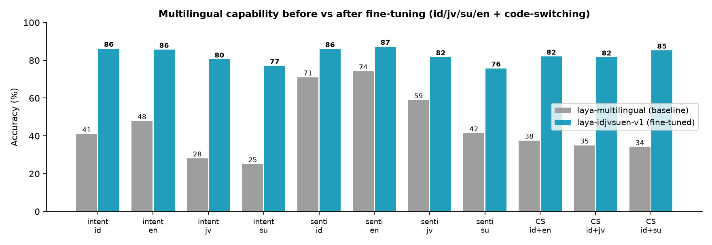

# laya-idjvsuen

**Language**: [Indonesia](README.md) | **English**

A fine-tune of [ConvAI Innovations Laya](https://huggingface.co/convaiinnovations/laya-multilingual)
(a non-generative *decision model*, Apache-2.0) so its classification/decision capability works
well on **Indonesian, Javanese, Sundanese, English, and mixed (code-switched) input**.

> Laya is a decision model (typed choice/score/noul questions with calibrated probabilities),
> not a generative model — it never produces text, and this project does not change that.
> Upstream SDK & code: [NandhaKishorM/laya](https://github.com/NandhaKishorM/laya) (not vendored
> in this repo; `pip install laya`).

## Model versions

| Version | Focus | HuggingFace | Local |
|---|---|---|---|
| **v1** | general multilingual: MASSIVE 60-class intent + NusaX sentiment (id/jv/su/en + CS) | [faall7479/laya-idjvsuen-v1](https://huggingface.co/faall7479/laya-idjvsuen-v1) | `runs/laya-idjvsuen-v1` |
| v2 | v1 + early ticket-domain version (superseded by v3; not published) | — | `runs/laya-idjvsuen-v2` |
| **v3** | v1 + 12-category ticket domain (rare-class boosted) — **recommended for ticket routing** | [faall7479/laya-idjvsuen-v3](https://huggingface.co/faall7479/laya-idjvsuen-v3) | `runs/laya-idjvsuen-v3` |

*Convention: whenever a new model version is produced, this table and the `docs/` documentation are updated.*

## Results (accuracy, baseline → fine-tuned)

| Task | Baseline | Result |
|---|---|---|
| 60-class intent — id / en (MASSIVE) | 41.0% / 47.9% | **86.2% / 85.7%** |
| 60-class intent — jv / su (NLLB-translated) | 28.1% / 25.2% | **80.5% / 77.2%** |
| Sentiment — id / jv / su / en (NusaX) | 41–74% | **76–87%** |
| Code-switch id+en / id+jv / id+su (synthetic) | 34–38% | **82–85%** |

ECE (calibration error) drops on every test set. Model: [faall7479/laya-idjvsuen-v1](https://huggingface.co/faall7479/laya-idjvsuen-v1).

## Benchmark vs Jev (OpenRouter)

12-category internal ticket-domain classification on **identical 300 real samples** for every
participant (gold = weak labels; methodology: [docs/BENCHMARK.en.md](docs/BENCHMARK.en.md)):




The latest variant `laya-idjvsuen-v3` (domain fine-tune + rare-class boost) reaches
**93.3% accuracy / ECE 0.015** on the identical samples — beating Jev 1.13 (84.7%) while
running locally with zero API cost.

## Usage

```bash
pip install laya
```

```python
import laya
agent = laya.load("faall7479/laya-idjvsuen-v1")  # or "faall7479/laya-idjvsuen-v3" (ticket domain)
r = agent.predict("Pelayanane elek tenan, aku ora arep balik maneh", {
    "s": {"type": "choice", "instructions": "What is the sentiment of the text?",
          "criteria": {"negative": "negative opinion",
                       "neutral": "neutral or factual",
                       "positive": "positive opinion"}},
})
print(r["answers"]["s"]["choice"], r["answers"]["s"]["answer_confidence"])
```

## Pipeline (repro)

```bash
python scripts/01_download_data.py     # MASSIVE id/en + NusaX-senti (4 languages)
python scripts/02_translate_jav_sun.py # jv/su augmentation via NLLB (optional)
python scripts/03_build_dataset.py     # typed-decisions items
python scripts/05_eval.py --tag baseline
python scripts/04_train.py             # RLCD + CE, ~2 h on an 8 GB GPU
python scripts/05_eval.py --model runs/laya-idjvsuen-v1 --tag finetuned
python scripts/06_compare.py           # baseline vs results table
python scripts/07_publish_hf.py --repo-id faall7479/laya-idjvsuen-v3  # publish (concrete example)
```

Stage 2 (optional) — internal ticket-domain adaptation (scripts 08-12, data pulled from
internal databases via `secrets/db.ini`): see [docs/PIPELINE.en.md](docs/PIPELINE.en.md).

Stage 3 (optional) — **v4** generalization from v1, outside the ticket domain (SIB-200
topics in id/jv/su/en + IndoNLU + replay): run `python scripts/15_build_general.py`, then
train on a Colab T4 via [notebooks/colab_v4_general.ipynb](notebooks/colab_v4_general.ipynb).

## Full documentation

Everything detailed lives in [`docs/`](docs/), available in both languages (id + en):

| Document | Indonesia | English |
|---|---|---|
| Deep research | [RISET-LAYA.md](docs/RISET-LAYA.md) | [RISET-LAYA.en.md](docs/RISET-LAYA.en.md) |
| Jev (TypeSafe) research + gap analysis | [RISET-JEV.md](docs/RISET-JEV.md) | [RISET-JEV.en.md](docs/RISET-JEV.en.md) |
| Pipeline guide | [PIPELINE.md](docs/PIPELINE.md) | [PIPELINE.en.md](docs/PIPELINE.en.md) |
| Results & evaluation | [HASIL-RETRAINING.md](docs/HASIL-RETRAINING.md) | [HASIL-RETRAINING.en.md](docs/HASIL-RETRAINING.en.md) |
| HF model card | [MODEL-CARD.md](docs/MODEL-CARD.md) | [MODEL-CARD.en.md](docs/MODEL-CARD.en.md) |

## License

- This project's code: **Apache-2.0** (matching Laya upstream).
- Fine-tuned model weights: **CC-BY-SA-4.0** — the NusaX training data is share-alike;
  see [docs/MODEL-CARD.en.md](docs/MODEL-CARD.en.md) for full licensing notes
  (including the NLLB non-commercial caveat on the jv/su intent subset).
