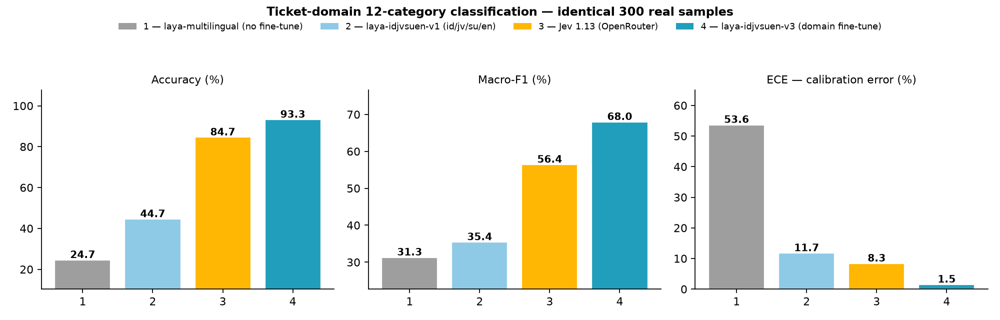
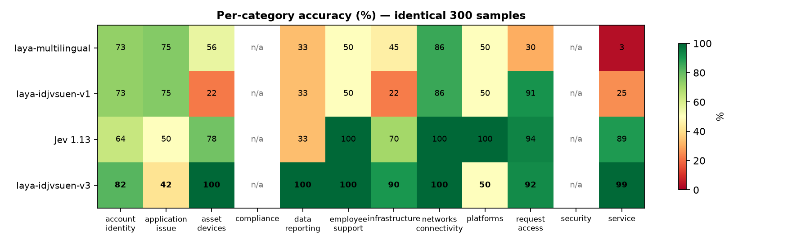

---
language:
  - id
  - jv
  - su
  - en
license: cc-by-sa-4.0
base_model: convaiinnovations/laya-multilingual
tags:
  - text-classification
  - decision-model
  - laya
  - indonesian
  - javanese
  - sundanese
  - code-switching
library_name: transformers
metrics:
  - accuracy
  - f1
---

# laya-idjvsuen-v1

**Bahasa / Language**: [Indonesia](MODEL-CARD.md) | **English**

A **multilingual fine-tune of [convaiinnovations/laya-multilingual](https://huggingface.co/convaiinnovations/laya-multilingual)**
for calibrated typed decisions (`choice` / `score` / `noul`) on **Indonesian (id), Javanese (jv),
Sundanese (su), English (en), and code-switched** input.

**Author**: muhfalihr ([github.com/muhfalihr](https://github.com/muhfalihr))

| Model | Focus | Link |
|---|---|---|
| **laya-idjvsuen-v1** | general multilingual (this repo) | this repo |
| laya-idjvsuen-v3 | v1 + 12-category ticket domain (recommended for ticket routing) | [faall7479/laya-idjvsuen-v3](https://huggingface.co/faall7479/laya-idjvsuen-v3) |
| laya-idjvsuen-v4 | generalization from v1: + SIB-200 topics + IndoNLU (recommended for general classification) | [faall7479/laya-idjvsuen-v4](https://huggingface.co/faall7479/laya-idjvsuen-v4) |

This is a non-autoregressive encoder-based decision model (mmBERT-base, 322M parameters):
a single forward pass returns a typed answer plus a calibrated probability. **The model never
generates text** and is not a chatbot. It builds on the work of [ConvAI Innovations](https://huggingface.co/convaiinnovations)
with the open-source [NandhaKishorM/laya](https://github.com/NandhaKishorM/laya) SDK (Apache-2.0).

## Usage

```bash
pip install laya
```

```python
import laya

agent = laya.load("<this-repo-id>")

# Sentiment (choice, 3 options)
r = agent.predict("Pelayanane elek tenan, aku ora arep balik maneh", {
    "sentiment": {"type": "choice",
                  "instructions": "What is the sentiment of the text?",
                  "criteria": {"negative": "the text expresses a negative opinion",
                               "neutral": "the text is neutral or factual",
                               "positive": "the text expresses a positive opinion"}}
})
# r["answers"]["sentiment"]["choice"] -> "negative" | "probabilities" | "answer_confidence"

# Intent (choice, 60 MASSIVE options)
opts = {"alarm_set": None, "calendar_set": None, "qa_factoid": None, ...}  # 60 MASSIVE intents
r = agent.predict("bangunkan saya pukul lima pagi minggu ini", {
    "intent": {"type": "choice",
               "instructions": "Classify the user's utterance into the most likely intent.",
               "criteria": opts}
})
```

For the full list of 60 intents in the exact option order used during training, see the
`question_defs.json` file in this model repo (or [MASSIVE](https://github.com/alexa/massive)).

## Training data

| Task | Languages | Train | Test | Source | Data license |
|---|---|---|---|---|---|
| Intent (60 classes) | id, en | 13,547 / lang | 2,000 / lang | MASSIVE 1.1 | CC-BY-4.0 |
| Intent (60 classes) | jv, su | 7,000 / lang | 2,000 / lang | machine translation id→jv/su (NLLB-200-distilled-600M) | see note |
| Sentiment (3 classes) | id, jv, su, en | 500 / lang | 400 / lang | NusaX-senti (native-speaker manual annotation) | CC-BY-SA-4.0 |
| Code-switching (eval only) | id+en, id+jv, id+su | — | 500 / combo | synthetic parallel half-splice | — |

43,094 training items in total; 400 items held out for temperature calibration fitting.

## Training procedure

The RLCD recipe from the [official Laya notebook](https://github.com/NandhaKishorM/laya/blob/main/notebooks/laya_finetune_typed_decisions_2xT4_kaggle.ipynb),
adapted to a single consumer GPU:

- Objective: policy gradient (REINFORCE, group-mean baseline, G=4, σ 0.4→0.1) with a
  *strictly proper scoring rule* reward (log + spherical 0.75 + RPS 1.0) **plus** full soft
  cross-entropy supervision.
- Optimizer: 8-bit AdamW, wd 0.01 — encoder LR 2.5e-5, head LR 1e-4, cosine decay + 60-step warmup.
- Effective batch 64 (4 × 16 accumulation), bf16 autocast, gradient checkpointing.
- 3 epochs ≈ 103 minutes on a single RTX 5050 Laptop 8 GB.
- Post-training: per-question-type temperature fitted on the hold-out — `choice` 3.52
  (shipped in `rl_agent_config.json`, applied automatically by the SDK).
- Config changes vs the base checkpoint: `max_len` 1024→768, `head_max_len` 256→512
  (so 60 intent options are no longer identically truncated).

## Evaluation results

Accuracy on the test sets (evaluated through the SDK inference path with shipped temperatures):

| Test set | n | Baseline | This model | ECE base → FT |
|---|---|---|---|---|
| Intent id (MASSIVE) | 2,000 | 0.410 | **0.862** | 0.213 → 0.064 |
| Intent en (MASSIVE) | 2,000 | 0.479 | **0.857** | 0.203 → 0.056 |
| Intent jv (NLLB-translated) | 2,000 | 0.281 | **0.805** | 0.251 → 0.081 |
| Intent su (NLLB-translated) | 2,000 | 0.252 | **0.772** | 0.211 → 0.080 |
| Sentiment id (NusaX) | 400 | 0.710 | **0.860** | 0.159 → 0.121 |
| Sentiment en (NusaX) | 400 | 0.743 | **0.873** | 0.121 → 0.105 |
| Sentiment jv (NusaX) | 400 | 0.590 | **0.818** | 0.236 → 0.151 |
| Sentiment su (NusaX) | 400 | 0.415 | **0.757** | 0.385 → 0.213 |
| CS id+en (synthetic) | 500 | 0.376 | **0.820** | 0.267 → 0.083 |
| CS id+jv (synthetic) | 500 | 0.350 | **0.816** | 0.277 → 0.071 |
| CS id+su (synthetic) | 500 | 0.342 | **0.852** | 0.234 → 0.065 |

Macro-F1 and full details: [`HASIL-RETRAINING.en.md`](HASIL-RETRAINING.en.md) in the pipeline repo.

### Benchmark vs Jev (OpenRouter) — ticket-domain 12 categories, identical 300 real samples





The latest domain fine-tune of this model family
([laya-idjvsuen-v3](https://huggingface.co/faall7479/laya-idjvsuen-v3)) reaches 93.3% accuracy /
ECE 0.015 on the identical samples, vs Jev 1.13 at 84.7% — running locally with zero API cost.
Gold = weak labels; methodology and honest caveats: `BENCHMARK.en.md` in the
[pipeline repo](https://github.com/muhfalihr/laya-idjvsuen).

## Limitations

1. **Not a generative model** — it only answers caller-defined typed questions
   (choice/score/noul) with caller-defined options.
2. **jv/su intent was trained and evaluated on machine-translated text** (NLLB). Accuracy on
   authentically human-written jv/su is expected to be lower; the honest human-text numbers are
   the NusaX rows.
3. **Code-switching evaluation is synthetic** (parallel half-splices), not natural social-media
   code-switching. No mature public EN-ID CS benchmark exists yet.
4. **Task coverage is narrow**: MASSIVE intent + sentiment. Typed-decision capability on other
   tasks (e.g. Laya's original benchmarks: Banking77, SST-5, XNLI) was not re-measured after
   fine-tuning.
5. Calibration was fitted on these two tasks' distribution; use `answer_confidence` with care
   out of distribution.

## License & attribution

- These fine-tuned weights are released under **CC-BY-SA-4.0** (NusaX data is share-alike).
- Base model [convaiinnovations/laya-multilingual](https://huggingface.co/convaiinnovations/laya-multilingual):
  **Apache-2.0** © ConvAI Innovations; [NandhaKishorM/laya](https://github.com/NandhaKishorM/laya) SDK: Apache-2.0.
- MASSIVE 1.1 © Amazon: CC-BY-4.0. NusaX-senti © IndoNLP: CC-BY-SA-4.0.
- ⚠️ The jv/su intent subset was produced with [facebook/nllb-200-distilled-600M](https://huggingface.co/facebook/nllb-200-distilled-600M),
  which is licensed **CC-BY-NC-4.0** (non-commercial). For commercial use, replace that subset
  with translations from a permissively-licensed MT model or human annotation and retrain
  (the full pipeline is available in the repo).

## Citation

```bibtex
@misc{laya-idjvsuen-v1,
  title  = {laya-idjvsuen-v1: multilingual Laya decision model fine-tuned for Indonesian, Javanese, Sundanese, English, and code-switching},
  author = {muhfalihr},
  year   = {2026},
  note   = {Fine-tune of convaiinnovations/laya-multilingual (Apache-2.0) on MASSIVE 1.1, NusaX-senti, and NLLB-generated translations},
  url    = {https://huggingface.co/<this-repo-id>}
}
```
